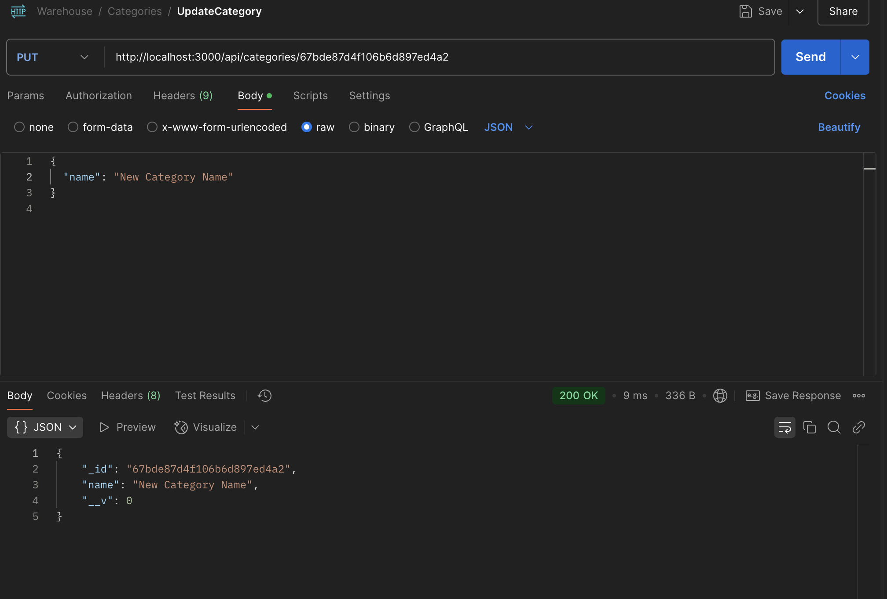
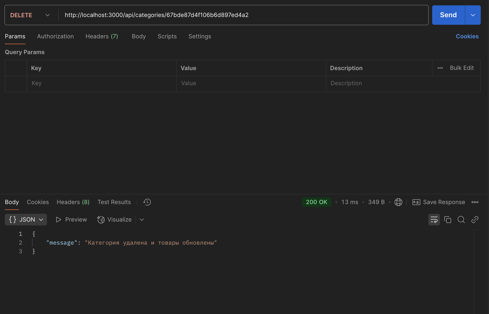

# HW5 React: Warehouse backend

## Используемая БД: MongoDB

## В качестве дополнительных улучшений для проекта сделан Swagger и подготовлена коллекция тестов для Postman (файл PostmanTests/Warehouse.postman_collection.json)

## Инструкция по запуску:
Развернуть контейнеры
```zsh
    docker-compose up
```
Заполнение моковыми данными:
```zsh
    cd server
    npm run seed
```
Сервер доступен на порту 3000 (http://localhost:3000/)

Клиент доступен на порту 5137 (http://localhost:5173/)

Сваггер: http://localhost:3000/api-docs/#/

## Инструкция по импорту коллекции тестов в Postman:
1. Нажать на кнопку Import 
2. Нажать на files 
3. Выбрать и импортировать файл с тестами 

## Скриншоты с тестами (не все случаи на скриншотах, лучше потыкаться)






